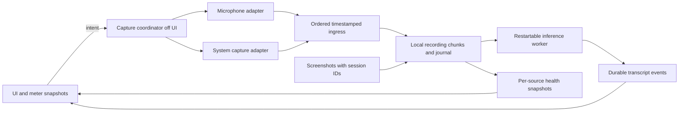

# Muesli / Muesley production reliability audit

5 September 2026. Audited checkout: `64cbcafd9d046c65f89934588cd1d13d29a17351` (11 August). Analysis and verification only; application behaviour and installed app unchanged.

## Decision

**This checkout is not ready for a public release. The principal problem is incomplete ownership of the capture lifecycle, with a compiler-confirmed UI dependency in the microphone data path.** Bluetooth exposes these weaknesses; it is not an adequate explanation for all of them.

Preserve the valuable product: independent microphone and system tracks, local inference, recoverable source material, screenshots, and later speaker identification/merging. Make preservation of those sources the primary responsibility. Live transcription and the interface should consume recording progress without controlling whether the source survives.

The necessary work is a coherent capture-runtime refactor with acceptance tests, delivered in reviewable increments. Another timer, retry count, or audio API swap would not establish reliability. Neither would a passing unit suite alone. There is no credible promise that macOS hardware will never fail; there can be a credible contract for detecting failures, recovering within a bound, and accurately reporting any lost interval.

## Evidence and limits

Inspected current Swift capture, device policy, preview, lifecycle, backend protocol, persistence, screenshots, and Python alignment/model paths; local git history; GitHub PRs 1–4; June/July audits and August exploration/plan. Historical notes were treated as claims to verify, not authority over current code.

Current verification:

- 116 Swift tests passed, 0 failures. The test target compiles selected helper sources; it does not exercise `AppModel`, `MicEngine`, `CaptureEngine`, or the actual meeting callback wiring.
- Release build succeeded with ad-hoc signing. This verifies compilation, not distribution signing or hardware reliability.
- 46 backend tests passed. These are existing automated tests, not an accuracy benchmark with downloaded models or a hardware capture test.
- Generated compiler intermediate output for the actual app sources with the project's Swift 5 language mode, MainActor default isolation and upcoming concurrency flags. It proves a MainActor hop before microphone forwarding. The relevant function is preserved in [compiler-mic-delivery.sil.txt](compiler-mic-delivery.sil.txt); [check_compiler.py](check_compiler.py) regenerates it from the actual app sources.
- Preserved 35 distinct source warning locations from the Debug build in [build-warnings.txt](build-warnings.txt). Most concern isolation boundaries; the number is not a count of independent bugs.
- Ran [check_timing.py](check_timing.py), which executes the actual Python alignment function extracted from this checkout, with controlled timestamps and in-memory sinks. Three complete 100 ms source chunks become 401 ms of output containing 200 ms of inserted silence and 99 ms of discarded source when timestamped at delayed delivery times. Source timestamps preserve all 300 ms. This proves the mechanism under controlled scheduling, not the amount of loss in David's meetings.

Initial sandbox runs could not use Xcode's test service and aborted importing the MLX dependency; rerunning the existing suites with local runtime access succeeded. Logs/results are in `/private/tmp/muesli-audit-*20260905*`. No actual meeting contents were uploaded or hardware routes changed. No new meeting was recorded. The installed app reports version 1.0/build 1; there is no verified commit-to-installed-binary mapping here. Conclusions apply to the audited checkout, and hardware attribution remains bounded accordingly.

## Why the history did not converge

| Work | Valuable improvement | Boundary left open in this checkout |
|---|---|---|
| May AEC changes, PRs [1](https://github.com/DavidFarrell/muesli/pull/1), [2](https://github.com/DavidFarrell/muesli/pull/2), [3](https://github.com/DavidFarrell/muesli/pull/3) | Explicit AEC policy, safer startup order, downgrade handling | Preview policy parity and all failure classes are not covered |
| `ec24653`, June device redesign | Stable UID intent, follow/pin policy, chained restarts | Rebuild decisions still confuse unchanged device identity with a valid running graph |
| July recovery/preview/CaptureSession changes | Recovery ladder, preview engine selection, alternative pinned-device capture | Preview lacks ongoing health supervision; system capture lacks equivalent recovery |
| `cafca18`, July UI/livelock work | Forwarder actor, meter throttling, log writer | Actual AppModel callback still creates a MainActor-inherited task before forwarding |
| `ad57496`, timestamp fix | Meeting epoch survives microphone restart | PTS still describes delivery time, not original capture time |
| July backend readiness/backpressure changes | Backend acknowledgment before enabling output, bounded pending audio and writer backlog | Durable audio still depends on the inference process; model/UI events can be dropped |
| August lifecycle exploration | Corrected an unsupported stderr-deadlock diagnosis | Its watchdog and system-observability recommendations remain unimplemented |
| [PR 4](https://github.com/DavidFarrell/muesli/pull/4), exception bridge | Converts a particular startup crash into a Swift error | General start errors can terminate the recovery sequence with a nil engine |

The strongest recurring process failure is accepting local component correctness as proof of the complete recording contract. “Off MainActor” in a comment, “engine started” in a log, a tick on Refresh, and a green pure-function test each establish less than the surrounding product assumes.

The August corrected exploration also cannot explain every current problem: it explicitly leaves system zeroing and mic loss mechanisms open. The compiler finding below supplies a mic failure mechanism; it does not retroactively prove the precise cause of that historical incident. The older permanent-stderr-deadlock theory should not be revived without new evidence.

## Findings requiring action

Severity P1 means potential loss of source material or failure of an advertised recovery path. P2 means a significant integrity, diagnostic or release-readiness gap. Confidence labels distinguish code/compiler facts from conditions not reproduced on hardware.

### F1 — P1: microphone delivery still depends on the UI executor

**Confirmed by compiler output.** `AppModel.swift:1294–1305` constructs the audio callback within MainActor isolation. Its nested `Task` inherits that isolation even though the spelling `@MainActor` has been removed. The generated task body first obtains `MainActor.shared` and performs `hop_to_executor`, and only then reads the forwarder and hops to `MicAudioForwarder.deliver`.

Thus a blocked UI delays real delivery, not just meter presentation. Independent actor implementation of the forwarder does not fix the call site. Delayed per-buffer tasks may also accumulate, beyond the byte caps on downstream rings.

**Repair:** establish an explicitly non-UI, sendable ingress boundary that captures the forwarder/recording sink and a generation token, rather than AppModel. Use an ordered bounded ingress queue, not one unbounded task per buffer. Only publish a coalesced display snapshot after the source is handed off. Correct isolation declarations on the dependencies as part of this change; do not suppress the warnings or scatter `nonisolated(unsafe)` annotations.

**Acceptance:** drive the actual application wiring with fake capture buffers while deliberately blocking MainActor; source ingestion and durable-write progress must continue, while display updates may lag. Testing the forwarder directly is insufficient.

### F2 — P1: idle preview can remain dead indefinitely; Refresh does not reset system capture

**Confirmed from source.** Preview starts in `startHomeLevelPreviewNow` (`AppModel.swift:1026`) and has no continuous microphone watchdog. The meeting watchdog only runs after meeting start. `refreshMicrophones` (`:1653`) delegates idle recovery to `restartPreviewMicEngineForInputSwitch` (`:1420`), which stops only the preview mic. The subsequent preview start skips system capture when `isPreviewCaptureRunning` is true.

This is a direct structural explanation for “Refresh sometimes works, quit/relaunch works”: a failed system preview can retain the running flag and its old `SCStream` across Refresh. `refreshHomeLevelPreview` would reset both preview sources, but the audio Refresh button does not call it.

Preview also fails to apply some AEC/output changes: the AEC property's `didSet` (`:148`) and output-change handler (`:1730`) only restart during meetings. A built-in-to-headphones output change with the same mic can leave preview on its previous voice-processing configuration.

**Repair:** share supervision and route reconciliation between preview and recording. Let preview differ in its sink, not in its correctness rules. A manual audio reset must cover both requested preview sources and report each outcome. During recording, reset only the affected source and preserve other tracks.

**Acceptance:** start-screen-only route cycling, unchanged-ID graph invalidation, failed initial starts, and system-only failure followed by Refresh. No departure from the start screen or relaunch may be necessary.

### F3 — P1: configuration invalidation is treated as device enumeration

**Confirmed API/code mismatch.** Both configuration callbacks (`AppModel.swift:1107`, `:1286`) call `loadInputDevices`. Its restart decision (`:2014`) compares resolved device ID and engine kind. An unchanged ID/kind suppresses the rebuild even when the engine has become invalid.

Apple states that an input/output sample-rate or channel-count change stops and uninitializes AVAudioEngine while leaving connections in their previous formats. A route graph can therefore be invalid while its device identity remains unchanged. See [Apple's configuration-change contract](https://developer.apple.com/documentation/foundation/nsnotification/name-swift.struct/avaudioengineconfigurationchange). The same callback abstraction also hides AVCaptureSession runtime errors behind a re-enumeration that may do nothing.

**Repair:** distinguish “device inventory changed” from “this engine generation was invalidated.” The latter requires reconciliation/reconstruction even if UID and engine kind match. Tag callbacks with their originating generation, ignore retired callbacks, and re-resolve a full configuration when work actually executes. Do not tear down AVAudioEngine synchronously inside Apple's notification callback; Apple warns that this can deadlock.

**Acceptance:** same-device sample-rate/channel changes, stale callbacks after replacement, and bursts of notifications produce one settled working generation. The pure ID comparison tests do not cover this contract.

### F4 — P1: recovery can stop after a thrown start failure; the UI can imply success

**Confirmed from source.** `handleMicStartFailure` (`AppModel.swift:1365`) sets the engine and started-at timestamp to nil, stops the forwarder, cancels the startup probe and clears the mic alert. The continuous watchdog (`:1476`) skips recovery if the engine is nil. Consequently a rebuild that throws can leave the ladder unable to make its next attempt. A debug error remains available; this is not a claim that absolutely no error is surfaced.

The synchronous VPIO downgrade branch (`:1345`) recognizes only `invalidInputFormat` with VPIO requested. Other thrown voice-processing errors, including the new exception-wrapper type, reach the general failure path. The exception bridge prevents a crash but does not itself ensure recovery.

`RefreshFeedbackButton` (`SessionView.swift:351`) changes to a checkmark whenever its `Void` action returns. The action awaits lifecycle work, not first valid buffers or saved-audio acknowledgment. The checkmark therefore proves neither capture recovery nor recording integrity.

**Repair:** make `failed-to-start` a supervised state with typed errors, bounded attempts/backoff, and a terminal visible result. Verify actual data flow after every start, including preview. Return per-source recovery outcomes to Refresh. Preserve degraded/error status until measured recovery rather than resetting it when issuing an attempt.

**Acceptance:** injected exceptions on first and later attempts, permission failure, device return, and live-engine/no-buffers states. Every path must converge to healthy, explicitly degraded, or failed—never an unmonitored nil engine.

### F5 — P1: system-audio stop handling does not reconcile capture state

**Confirmed from source.** `CaptureEngine.swift:464` reports stream stop; AppModel's handler (`:402`) writes a log line. It does not clear the preview running flag, transition a system health state, or arrange recovery. There is no equivalent of microphone heartbeat/recovery for this source. Its debug counters advance through the display meter gate (`CaptureEngine.swift:396`), so they are not raw callback counters.

**Repair:** give the system source its own generation, raw-callback telemetry and explicit lifecycle. Handle OS stop/error as a state transition with bounded recovery. Collect callback, conversion, source timestamp, ingress, persisted samples and discontinuities separately from UI levels. Log route snapshots outside audio callbacks.

**Important limit:** zero samples are not proof of failure. macOS can legitimately have nothing to play. Absent system callbacks likewise needs an empirically verified expectation for the supported route/OS. Use explicit stream failures and controlled-source tests; do not restart every few seconds of ordinary silence.

**Acceptance:** injected SCStream stop and conversion failures, legitimate long silence without restart loops, and a known continuous system signal across real output changes. Compare callback evidence with WAV and, where enabled, MP4; those are parallel outputs, not an end-to-end chain.

### F6 — P1: delivery timestamps can turn recoverable scheduling delay into discarded audio

**Confirmed mechanism and controlled reproduction.** `MicEngine.swift:138` discards AVAudioTime. `CaptureSessionMicEngine.handleSampleBuffer` forwards converted bytes without their sample-buffer PTS. `MicCapturing` carries only `Data`. `MicAudioForwarder.swift:275–284` assigns timestamps when queued work finally executes. The backend's `write_aligned_audio` (`muesli_backend.py:199`) correctly follows those supplied timestamps, inserting zeros for gaps and trimming overlaps.

The included experiment supplies complete consecutive source chunks with delayed/bunched delivery timestamps. It demonstrates loss without any microphone failure. This compounds F1: even if queued buffers later arrive, using arrival time can prevent recovering their original audio/timing.

System audio establishes zero from its first buffer (`CaptureEngine.swift:376`), whereas the mic clock begins later after `startCapture` returns (`AppModel.swift:2468–2476`). Those origins are not explicitly calibrated. Exact drift in actual meetings remains unmeasured.

**Repair:** carry capture timestamps, frame counts, native format and generation with each buffer. Map both sources and screenshots to one defined meeting time domain, with explicit clock calibration and sleep policy. Preserve continuity across restarts; record gaps without disguising them. Resampling must retain phase/state across buffers and reset only for a genuine format epoch.

`AudioConverterHelper.swift:73–101` currently performs independent per-buffer linear interpolation. Its output length depends on partitioning and it has no persistent resampling phase or explicit anti-alias filter. Replace it with a measured streaming converter, preserving the intentional multichannel microphone downmix policy. Apple's [sample-rate conversion technote](https://developer.apple.com/documentation/technotes/tn3136-avaudioconverter-performing-sample-rate-conversions) documents the appropriate AVAudioConverter input-block API. This is a fidelity/timing issue, not a proven cause of route failure.

**Acceptance:** jitter/bunched delivery changes latency but not recorded samples/timestamps; chunk partitioning does not change duration; no restart resets the meeting epoch; an independent reference signal measures cross-source/screenshot alignment through a long run.

### F7 — P1: capture durability is coupled to the inference process and UI event consumer

**Confirmed architecture.** The Python process that hosts ASR also receives framed audio and owns WAV/PCM writing. Startup acknowledgment proves that writers were opened, not ongoing persistence. Backlog completion proves a pipe write, not disk durability. The existing caps are useful, but once the process cannot consume audio, the bounded queue necessarily drops source material.

Separately, `BackendProcess.swift:37` uses `AsyncStream.bufferingNewest(500)` for all JSON events and ignores the yield result. AppModel drains that stream on MainActor and only then appends to `transcript_events.jsonl` (`:677`, `:2425`). Backend meters (`--emit-meters`) share this queue with transcript, status and screenshot events. During a sufficiently long UI stall, final/control events can be displaced by newer meter events before reaching the journal. This risk does not depend on the disputed permanent-stderr-deadlock theory.

**Repair:** persist source audio independently of inference. A small recording owner writes recoverable chunks and a journal; inference consumes committed data and can stop/restart without stopping preservation. Persist authoritative events before UI delivery; coalesce/drop only disposable meter/partial updates according to explicit rules. Avoid two competing authoritative writers. Retain finite backpressure policy for actual disk failure and account for every dropped frame.

**Acceptance:** stall/kill/restart inference while known input continues: both source tracks remain recoverable. Freeze UI while emitting more than 500 mixed events: finalized/control events survive. Simulate disk failure: an off-UI health state records a precise failure rather than claiming healthy recording.

### F8 — P1/P2: lifecycle waits and stop completion do not establish a bounded outcome

**Confirmed code defects; hardware hang occurrence not reproduced.** The starvation watchdog's `withTaskGroup` (`MainActorStarvationWatchdog.swift:86`) waits for the blocked MainActor child even after the timer wins. Swift cancellation is cooperative and [a task group waits for its children](https://developer.apple.com/documentation/swift/taskgroup). It cannot report during the wedge it is intended to detect. `waitForStdoutDrain` (`AppModel.swift:2980`) repeats the same ineffective timeout pattern around `task.value`.

Stop first waits for the lifecycle chain and SCStream stop (`AppModel.swift:2727–2730`), before reaching the backend's bounded exit escalation. Those earlier operations have no deadline. Chaining tasks serializes them, but one stuck operation blocks all later Refresh/Stop work. Queued route notifications also are not coalesced and can perform obsolete redundant rebuilds.

`RecordingDelegate` is empty (`CaptureEngine.swift:532`), so MP4 completion/failure callbacks are not observed. `finalizeStoppedMeeting` eventually marks metadata completed even after backend termination; launch recovery also maps interrupted recordings to completed. The current two-state metadata cannot distinguish clean completion, interruption, partial source loss and recovery.

**Repair:** one explicit coordinator owns transition state and coalesces desired route changes. Every operation has a real deadline and an owner-correct completion event; expiration must not mean “cancel and pretend teardown finished.” A noncooperative framework call cannot be killed by cancelling a Swift task. If hardware fault injection shows such hangs within the promised support matrix, isolate capture in a restartable helper process; prove its permission/signing and chunk-recovery behaviour before shipping that boundary. Do not start a competing capture instance while a wedged old owner may still be active.

Use [SCRecordingOutputDelegate's finish/failure notifications](https://developer.apple.com/documentation/screencapturekit/screcordingoutputdelegate) to establish MP4 outcome. Record each artifact's outcome and a loss ledger atomically; interrupted-but-recoverable must remain distinguishable from complete. Persist useful diagnostics off MainActor using queue-owned probe state that allows at most one outstanding echo.

**Acceptance:** missing callbacks, permanently blocked operations, repeated Stop/Refresh, stop during restart, late completion from an old generation, forced child termination, and launch recovery. The deadline policy must either recover ownership safely or expose a bounded failed state; no infinite spinner and no false clean completion.

### F9 — P2: screenshots/resumed sessions lack a complete identity and completion contract

**Confirmed from source; overwrite occurrence not exercised.** Screenshot filenames/events use time since the current capture start (`ContentView.swift:646–685`), while resumed transcripts receive a separate offset. Resumes reuse the meeting's `screenshots` directory and `recording.mp4` path (`AppModel.swift:2454`, `:2554`). Screenshot time is therefore ambiguous across sessions and equal rounded timestamps can reuse a filename. MP4 behaviour on path reuse needs direct verification rather than an assumed overwrite claim.

Stopping the screenshot timer does not invalidate a capture completion already in flight. The completion uses AppModel's current writer without a session token. PNG finalization success is ignored before publishing the screenshot event. These weaknesses matter to later screenshot/transcript interleaving even when audio capture is healthy.

**Repair:** session/asset IDs and one time mapping, unique per-session media paths, generation-gated completions, and events emitted only after a successful atomic artifact write. Keep a compatibility reader/export for the existing meeting format and Merge workflow.

**Acceptance:** resume twice, stop with a screenshot in flight, immediately start another meeting, force PNG failure, and verify every event names the correct existing artifact and meeting time.

## Target design and non-negotiable contracts

Keep implementation small: explicit data types, a coordinator, concrete capture adapters, a recording store, and an inference worker interface. This does not require a dependency-injection framework or a hierarchy of capture strategies. The existing `MicCapturing` seam is a useful starting point.

MP4 remains a separate ScreenCaptureKit recording branch with its own completion status; the diagram's recording store owns the manifest, not an assertion that MP4 passes through the PCM ingress.

1. **Intent is separate from observation.** Following/pinned input, desired AEC and requested sources are user intent. Resolved UID, active format, effective AEC, callback progress and written sample range are observations. Neither `isRunning` nor an unchanged UID proves health.
2. **One lifecycle owner.** Preview, start, reconfigure, Refresh and stop reconcile through the same owner. Device notifications update desired state; they do not spawn independent complete rebuilds. At most one transition per source may own hardware.
3. **Every asynchronous result is scoped.** Meeting ID, source ID and generation accompany callbacks, health reports, faults and completions. An obsolete callback cannot mutate the new meeting or certify it healthy.
4. **Capture precedes inference.** Once the recorder accepts source samples, model failure cannot destroy them. Define what “written” means and a crash-loss budget; an enqueue or buffered file write is not a power-loss durability acknowledgment.
5. **Health is independent of amplitude and UI.** A quiet room is healthy if valid expected capture progresses. Persisted samples and processing progress are separate states. A stopped device is not repaired by a moving stale display meter.
6. **Reset has a verifiable result.** The idle action re-acquires both requested sources. A recording reset replaces only affected resources, retains meeting time and documents its interruption. Where SCStream replacement also interrupts MP4, close a segment and record that boundary; never claim uninterrupted video.
7. **Failure is a valid final state.** If hardware cannot recover, preserve the other source and clearly identify the unavailable source and lost interval. Do not automatically terminate the entire meeting merely because the UI stalls.

Recommended source policy: retain the two existing mic adapters initially and test both under the shared contract. Do not adopt a third capture API as a speculative cure. Evaluate using AVCaptureSession for all non-AEC mic capture to remove route-relative adapter switching, but select that policy only after the actual microphone/BT matrix passes. Keep voice processing an explicit best-effort capability; auto mode's built-in-speaker default is a sensible conservative policy, not a guarantee that every requested VPIO path works.

Add explicit sleep/wake and device-disappearance handling. No dedicated sleep/wake lifecycle handler exists in the audited app. Define whether a temporarily missing pinned mic falls back and later returns; preserve user intent separately from the effective route so reconnection behaviour is deliberate rather than a consequence of a vanished integer ID.

## Delivery sequence with evidence required to finish

| Stage | Concrete output | Exit evidence |
|---|---|---|
| 1. Lock the failure contracts | Real AppModel ingress regression, preview/system reset tests, unchanged-ID invalidation, startup-error sequence, compiler isolation cleanup, independent watchdog | F1–F5 failure scenarios go red on this checkout and pass through the replacement coordinator/ingress; blocked UI cannot halt ingress |
| 2. Correct source time and preservation | Timestamped buffer contract, streaming converter, one meeting time map, recording store decoupled from ASR | Deterministic jitter/chunk/restart tests; inference outage preserves both controlled tracks; durable event queue does not lose final events |
| 3. Complete lifecycle ownership | Coalesced reconfiguration, generation scoping, honest reset outcomes, bounded stop, artifact completion, interruption metadata | Inject missing/late callbacks, device loss, disk error, process exit and repeated commands; all reach defined outcomes |
| 4. Protect the workflow | Session-scoped screenshots/video, schema compatibility, Merge handoff contract, offline readiness | Existing meetings remain readable, resumed screenshots align, reprocessing is repeatable, interrupted work cannot be silently deleted |
| 5. Qualify a release candidate | Hardware/soak evidence, supported-device list, reproducible build and offline setup | Matrix below passes on the exact signed release binary, with retained measurements |

Each stage should contain a small number of reviewable changes with a regression that failed for the demonstrated reason. These are increments of one design, not independent patches with unrelated state flags. The August plan contributes useful experiments and watchdog work; it should not be followed unchanged because it misses the compiler-confirmed ingress dependency and durability/timestamp defects established here.

## Proposed release gate

These are proposed product acceptance targets, not Apple guarantees or measurements already achieved.

- **A working day:** at least an 8-hour app-open run spanning idle preview, several recordings and normal navigation. No relaunch required. Track CPU, memory, descriptor count, active engine count and queue bounds; temporary caches may grow but must settle after repeated sessions.
- **Transitions:** at least 100 named route changes across built-in mic, Wireless RX, headphone mic, built-in speakers and Bluetooth output. Test follow and pin modes, AEC Auto/On/Off, preview and recording, switching during start/stop, rapid connect/disconnect, display removal and sleep/wake. Record OS/hardware/firmware and the exact app build.
- **Source fidelity:** use a controlled continuous system signal and an independently controlled acoustic mic source; headphone playback does not establish a known mic signal. Compare received samples, persisted samples, explicit gaps and output files against the reference. Require no unreported loss. Establish a measured cross-source sync tolerance suitable for Merge, provisionally 100 ms over an hour, and tighten if speaker assignment requires it.
- **Recovery:** provisionally detect loss of expected mic callbacks within 5 seconds and recover within 10 seconds after a usable route stabilizes, or present a persistent source-specific failure by that deadline. System silence needs its own verified expectation. Collect restart count and interruption duration, not just “worked once.”
- **Fault isolation:** block UI and inference separately, crash inference, interrupt the recorder, exhaust a test volume, remove permissions, and withhold stop/start callbacks. Accepted source is recoverable to the agreed crash boundary; other sources stay active when possible; no indefinite Stop/Refresh wait.
- **Truthful completion:** every clean result has confirmed artifact outcomes; every injected gap/interruption remains visible after relaunch, export and reprocessing. A Refresh checkmark requires the health result it claims.
- **Cold offline operation:** provision models/dependencies first, then launch, record and reprocess with network unavailable. Missing assets produce an explicit preflight result. Test the exact signed build, not only an ad-hoc Debug binary.

A healthy two-minute recording is useful but cannot pass the all-day requirement. A soak without a controlled signal can measure resource stability but cannot prove audio completeness. Automated lifecycle tests and real hardware runs are complementary; neither substitutes for the other.

## Whole-project release concerns outside the main audio diagnosis

- **Offline capability needs an enforceable mode.** Current ASR uses `from_pretrained(model_id)` and the README correctly mentions initial downloads, but this audit did not verify all dependency network behaviour. Local model inference is not itself proof of no network activity. Ship a local asset manifest/preflight, an explicit offline setting applied to dependencies, and a disconnected acceptance test. The in-app speaker identifier points at localhost Ollama; the external Claude Merge stage is a separate trust boundary.
- **Merge is not fully in scope of the available source.** The described Claude Code Muesli/Musely Merge orchestration and its trashing behaviour were not located in this project. The Python `merge.py` is word/speaker alignment, not evidence that the external workflow was audited. Define versioned inputs/outputs, source provenance, human-correctable inferred speaker names, screenshot IDs, successful-output checks and recoverable trashing before calling the whole workflow release-ready. Do not change that external workflow based on guesses.
- **Distribution is still a developer workflow.** The app locates a Python backend project and environment; Xcode targets macOS 26.2. A `uv.lock` exists, which is useful, but repeatable packaged environment/model installation, signed release validation, update/rollback and clean-machine onboarding remain release work. No tracked CI workflow was found. Dependency/model licensing is a separate release verification item; this audit makes no legal conclusion.
- **Build traceability matters.** The installed app's 1.0/build 1 cannot identify the source revision that produced a failure. Embed commit/build ID, runtime/model versions and schema version in diagnostic exports and meeting metadata. Keep private audio/transcript/screenshot content out of default diagnostics.
- **Storage outcomes need product semantics.** Current `.recording`/`.completed` is insufficient for interrupted sources. The metadata duration also uses time since original creation, which can include idle time between resumed sessions. Derive recorded durations from session/media ranges and keep wall-clock span separately.

## Recommended ownership stance

Accept responsibility for the recording contract rather than promising an eternally bug-free device stack. The product should know which source is captured, whether it is preserved, when a transition lost samples, and whether recovery really succeeded. Ship only once those claims are supported by the actual application wiring and an all-day hardware run.

The current code offers useful parts to retain. The evidence supports changing the lifecycle, timing and persistence boundaries—not discarding the local models or the two-track/screenshot workflow that make Muesley valuable.
